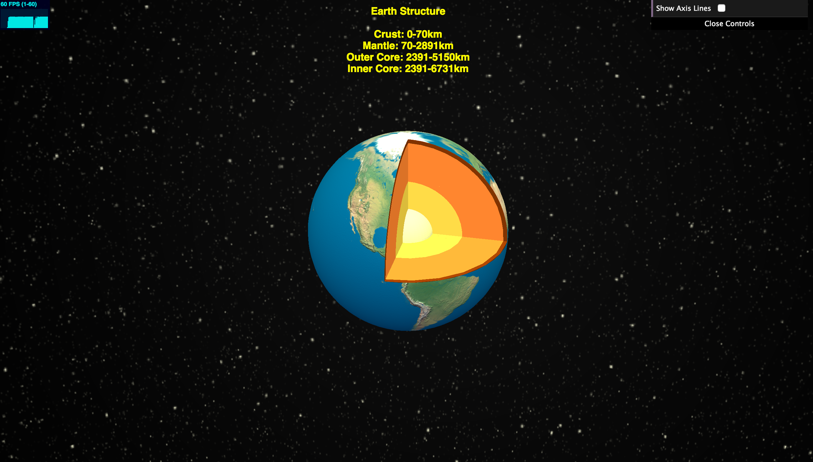
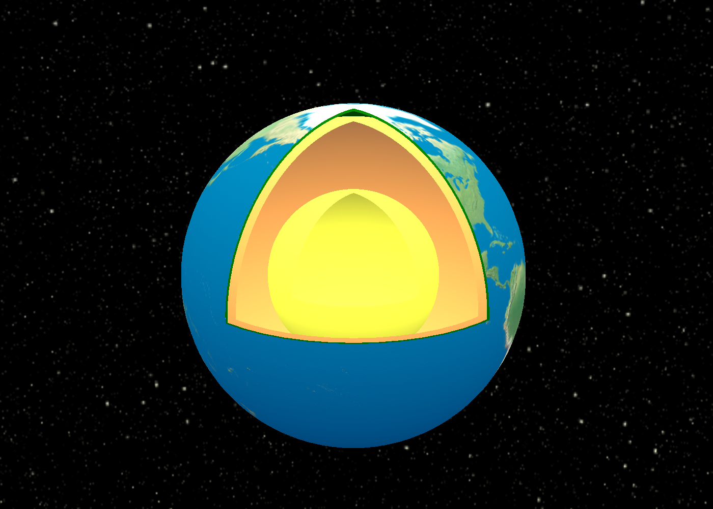
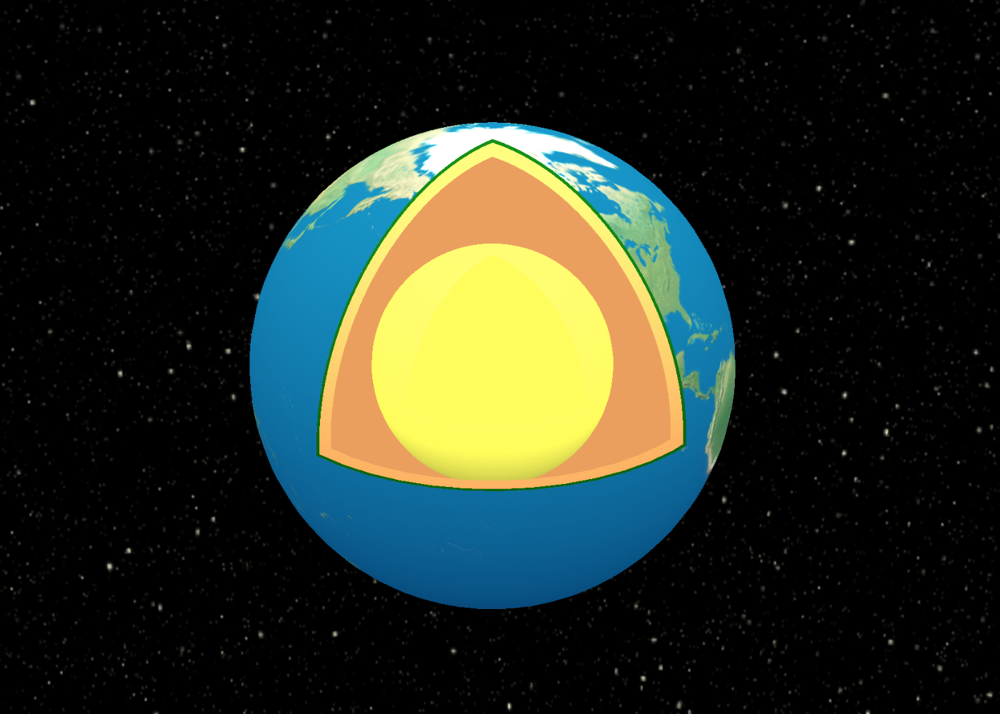

3D Earth Structure
====
### Introduction: ###  
This demo illustrates the inner structure of the earth in 3D. It uses OrbitControls so that users can drag to spin and zoom in/out. It also has GUI for users to switch the axis helper on and off. 
 ([view this demo](https://yiic.github.io/DataVisualization/earthStructure/earthStructure.html))
 
 
[](https://yiic.github.io/DataVisualization/earthStructure/earthStructure.html)
 
### Encountered Problems and Solutions ###
An Object created from three.js is not solid, in another words, it's more like a "hollow" object. The following picture shows the "hollow sphere".
 
 

 
 
However, the earth as well as layers in the earth need to be solid. To create solid spheres, the way [WestLangley](https://stackoverflow.com/questions/37090942/how-to-render-clipped-surfaces-as-solid-objects/37093210#37093210) mentioned does not work in this case. This way only change the texture and reflective effect of "cutting off" surface inside. I think this way only works for single object. If there are multiple objects nesting with each others, when they are clipped, the inner object is revealed in a way that still make the objects look like "hollow" objects.  The following picture shows the bad effect using in this way. 





I choose to use the library ["ThreeCSG.js"](https://github.com/chandlerprall/ThreeCSG). It's a CSG plugin for Three.js. The layers of crust, mantle, outer core and inner core are subtracting with each other in order to implement the effect of nesting layers. The outer surface is just a normal "hollow" sphere with an imported world map texture. In order to have the clip effects, the three solid layers crust, mantle, outer core are clipped by a solid cube while the outer surface "world map" is clipped by three planes. The clipIntersection needs to be set true. The following code is for generating a layer of Mantle with thickness of 0.96 using CSG in this demo. 

```js
    var geometry = new THREE.SphereGeometry( 0.96, 24, 24 ); // Take more time to load when increase the last two indexs.
    var mantle_mesh = new THREE.Mesh( geometry );
    var mantle_bsp = new ThreeBSP(mantle_mesh);

    var mantle_clip1 = mantle_bsp.subtract(cube_bsp);
    var mantle_clip2 = mantle_clip1.subtract(core_clip2);

    var mantle_result = mantle_clip2.toMesh(new THREE.MeshLambertMaterial({
        shading: THREE.SmoothShading,
        color: new THREE.Color( 0xff8533 )
    }));
```

To create a sphere, 3 parameters needs to be set. The parameters are radius, widthSegments, and heightSegments. 

```js
    var geometry = new THREE.SphereGeometry( 0.96, 24, 24 );
```

Adjustments of the radius can decide the thickness of each layer in the earth. The widthSegments and heightSegments can determine the "smooth" degree of the sphere. It should be noted that if the width segment and the height segment are set as very large number, it will take more time to load the page. So for the solid spheres,  I choose to set them as 24 for reasonable loading time. There outer surface is just a normal sphere without using CSG.  For this reason, in order to make the outer layer has less ''blocked'' surface,  the segments number can be set as a larger number. 


**Sources/Libraries need to be included:**
- three.js
- ThreeCSG.js
- stats.min.js
- OrbitControls.js
- dat.gui.js
